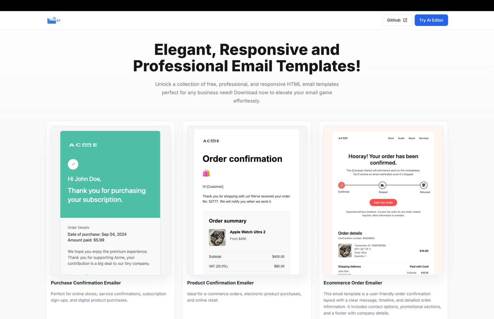

# Free Email Templates - Download Instantly, No Signups Required!

**⚡ Blazing-fast, responsive HTML email templates ready to copy, paste & send.**

---

## Table of Contents

1. [Live Demo](#live-demo)
2. [Available Templates](#available-templates)
3. [Setup](#setup-instructions)
4. [License](#license)

---

Unlock a collection of free, professional, and responsive HTML email templates perfect for any business need! Download now to elevate your email game effortlessly.

You can access the deployed templates at [https://nirajrajgor.github.io/email-templates/](https://nirajrajgor.github.io/email-templates/). No signup or registration is required; you can download the templates directly with just one click of a button!



## Live Demo

▶️ **Explore them here →** <https://nirajrajgor.github.io/email-templates/>

No signup required—download with a single click!

## Available Templates

- [Ecommerce Order Emailer](https://nirajrajgor.github.io/email-templates/preview.html?template=ecommerce-order)
- [Product Confirmation Template](https://nirajrajgor.github.io/email-templates/preview.html?template=product-confirmation)
- [Purchase Confirmation Template](https://nirajrajgor.github.io/email-templates/preview.html?template=purchase-confirmation)
- [Promotional Offer Template](https://nirajrajgor.github.io/email-templates/preview.html?template=promotional-offer)
- [Shopping Deals Email Template](https://nirajrajgor.github.io/email-templates/preview.html?template=shopping-deals)
- [Gift Decor Email Template](https://nirajrajgor.github.io/email-templates/preview.html?template=gift-decor)
- [Product Announcements Email Template](https://nirajrajgor.github.io/email-templates/preview.html?template=product-announcements)
- [AI Newsletter HTML Email Template](https://nirajrajgor.github.io/email-templates/preview.html?template=ai-newsletter)
- [Music Event HTML Email Template](https://nirajrajgor.github.io/email-templates/preview.html?template=music-event-promotion)
- [Password Reset HTML Email Template](https://nirajrajgor.github.io/email-templates/preview.html?template=password-reset)
- [Abandoned Cart HTML Email Template](https://nirajrajgor.github.io/email-templates/preview.html?template=abandoned-cart)
- [Account Verification HTML Email Template](https://nirajrajgor.github.io/email-templates/preview.html?template=account-verification)
- [Welcome Onboarding HTML Email Template](https://nirajrajgor.github.io/email-templates/preview.html?template=welcome-onboarding)
- [Product Review HTML Email Template](https://nirajrajgor.github.io/email-templates/preview.html?template=product-review)
- [Re-engagement HTML Email Template](https://nirajrajgor.github.io/email-templates/preview.html?template=reengagement)
- [Account Billing Update HTML Email Template](https://nirajrajgor.github.io/email-templates/preview.html?template=account-billing-update)
- [Product Promotion HTML Email Template](https://nirajrajgor.github.io/email-templates/preview.html?template=product-promotion)

- More templates are coming soon! Stay tuned for updates.

## Setup Instructions

1. Clone the repository:
   ```bash
   git clone https://github.com/nirajrajgor/email-templates.git
   ```
2. Navigate to the project directory:
   ```bash
   cd email-templates
   ```
3. Install the dependencies:
   ```bash
   npm install
   ```
4. Run locally
   ```bash
   npm run dev
   ```

# Support Our Project

If you find these templates useful, please consider starring the repository! Your support is greatly appreciated!

## Disclaimer

All content in these templates is for demonstration purposes only. Brand names, prices, and other details are placeholder text. Images are used solely for preview and illustration purposes.

## Keywords

HTML email templates • responsive email • free email template • newsletter design

## License

MIT — see [LICENSE](LICENSE).
