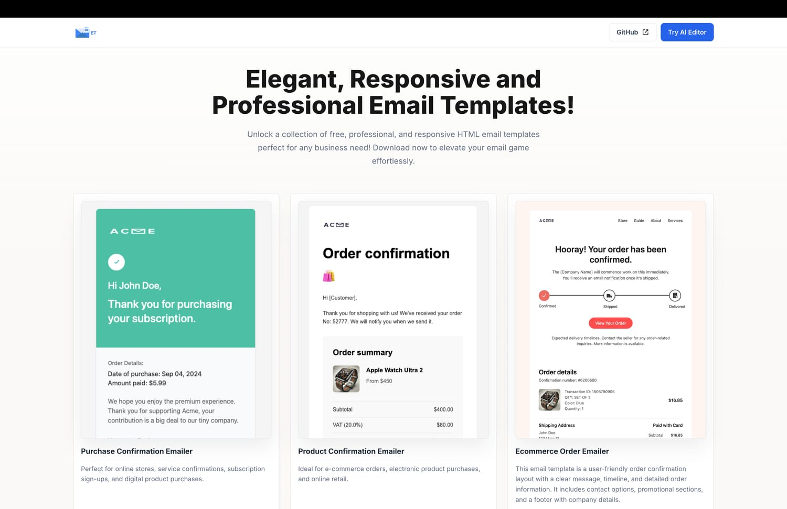

# Free Responsive HTML Email Templates

**Preview, customize, copy, and download responsive HTML email templates.**

---

## Table of Contents

1. [Live Demo](#live-demo)
2. [Customize to Your Brand](#customize-to-your-brand)
3. [Available Templates](#available-templates)
4. [Integration Collections](#integration-collections)
5. [Setup](#setup-instructions)
6. [License](#license)

---

Browse templates for transactional, ecommerce, authentication, and marketing emails. Customize colors in your browser, then copy or download the HTML. No signup is required.



## Live Demo

[Browse the live templates →](https://nirajrajgor.github.io/email-templates/)

## Customize to Your Brand

Each template preview includes a **Customize** button. Choose a brand color to update the palette while keeping neutral elements unchanged. Supported templates also let you choose an accent color.

When you are finished, copy the customized HTML or download it as a file.

## Available Templates

- [Ecommerce Order](https://nirajrajgor.github.io/email-templates/preview.html?template=ecommerce-order)
- [Product Confirmation](https://nirajrajgor.github.io/email-templates/preview.html?template=product-confirmation)
- [Purchase Confirmation](https://nirajrajgor.github.io/email-templates/preview.html?template=purchase-confirmation)
- [Promotional Offer](https://nirajrajgor.github.io/email-templates/preview.html?template=promotional-offer)
- [Shopping Deals](https://nirajrajgor.github.io/email-templates/preview.html?template=shopping-deals)
- [Gift Decor](https://nirajrajgor.github.io/email-templates/preview.html?template=gift-decor)
- [Product Announcement](https://nirajrajgor.github.io/email-templates/preview.html?template=product-announcements)
- [AI Newsletter](https://nirajrajgor.github.io/email-templates/preview.html?template=ai-newsletter)
- [Music Event Promotion](https://nirajrajgor.github.io/email-templates/preview.html?template=music-event-promotion)
- [Password Reset](https://nirajrajgor.github.io/email-templates/preview.html?template=password-reset)
- [Abandoned Cart](https://nirajrajgor.github.io/email-templates/preview.html?template=abandoned-cart)
- [Account Verification](https://nirajrajgor.github.io/email-templates/preview.html?template=account-verification)
- [Welcome and Onboarding](https://nirajrajgor.github.io/email-templates/preview.html?template=welcome-onboarding)
- [Product Review](https://nirajrajgor.github.io/email-templates/preview.html?template=product-review)
- [Re-engagement](https://nirajrajgor.github.io/email-templates/preview.html?template=reengagement)
- [Account Billing Update](https://nirajrajgor.github.io/email-templates/preview.html?template=account-billing-update)
- [Product Promotion](https://nirajrajgor.github.io/email-templates/preview.html?template=product-promotion)
- [Shipping Confirmation](https://nirajrajgor.github.io/email-templates/preview.html?template=shipping-confirmation)
- [Back in Stock](https://nirajrajgor.github.io/email-templates/preview.html?template=back-in-stock)
- [Supabase Confirm Signup](https://nirajrajgor.github.io/email-templates/preview.html?template=supabase-confirm-signup)
- [Supabase Reset Password](https://nirajrajgor.github.io/email-templates/preview.html?template=supabase-reset-password)
- [Supabase Magic Link](https://nirajrajgor.github.io/email-templates/preview.html?template=supabase-magic-link)
- [Supabase Email OTP](https://nirajrajgor.github.io/email-templates/preview.html?template=supabase-email-otp)
- [Supabase Invite User](https://nirajrajgor.github.io/email-templates/preview.html?template=supabase-invite-user)
- [Supabase Change Email Address](https://nirajrajgor.github.io/email-templates/preview.html?template=supabase-change-email)
- [Supabase Reauthentication](https://nirajrajgor.github.io/email-templates/preview.html?template=supabase-reauthentication)
- [Better Auth Verify Email](https://nirajrajgor.github.io/email-templates/preview.html?template=better-auth-verify-email)
- [Better Auth Reset Password](https://nirajrajgor.github.io/email-templates/preview.html?template=better-auth-reset-password)
- [Better Auth Magic Link](https://nirajrajgor.github.io/email-templates/preview.html?template=better-auth-magic-link)
- [Better Auth Email OTP](https://nirajrajgor.github.io/email-templates/preview.html?template=better-auth-email-otp)
- [Better Auth Invite Member](https://nirajrajgor.github.io/email-templates/preview.html?template=better-auth-invite-member)
- [Better Auth Change Email](https://nirajrajgor.github.io/email-templates/preview.html?template=better-auth-change-email)
- [Better Auth Delete Account](https://nirajrajgor.github.io/email-templates/preview.html?template=better-auth-delete-account)

## Integration Collections

- [Supabase Email Templates](https://nirajrajgor.github.io/email-templates/supabase.html) includes customizable Confirm Signup, Reset Password, Magic Link, Email OTP, Invite User, Change Email Address, and Reauthentication designs. Supabase variables are preserved during customization.
- [Better Auth Email Templates](https://nirajrajgor.github.io/email-templates/better-auth.html) includes customizable Verify Email, Reset Password, Magic Link, Email OTP, Invite Member, Change Email, and Delete Account designs. Better Auth placeholders are preserved during customization.

## Setup Instructions

1. Clone the repository:
   ```bash
   git clone https://github.com/nirajrajgor/email-templates.git
   ```
2. Navigate to the project directory:
   ```bash
   cd email-templates
   ```
3. Install the dependencies:
   ```bash
   npm install
   ```
4. Run locally
   ```bash
   npm run dev
   ```

## Support the Project

If these templates are useful, consider starring the repository.

## Disclaimer

All content in these templates is for demonstration purposes only. Brand names, prices, and other details are placeholder text. Images are used solely for preview and illustration purposes.

## Keywords

HTML email templates • responsive email • free email template • newsletter design

## License

MIT. See [LICENSE](LICENSE).
